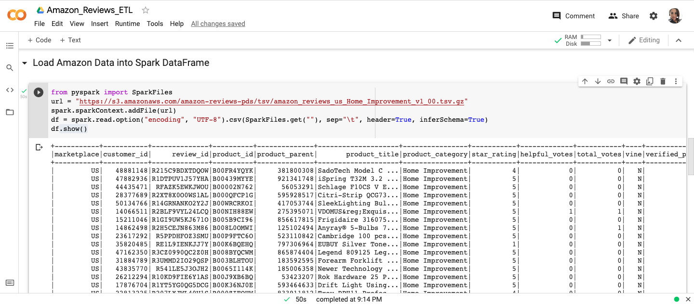
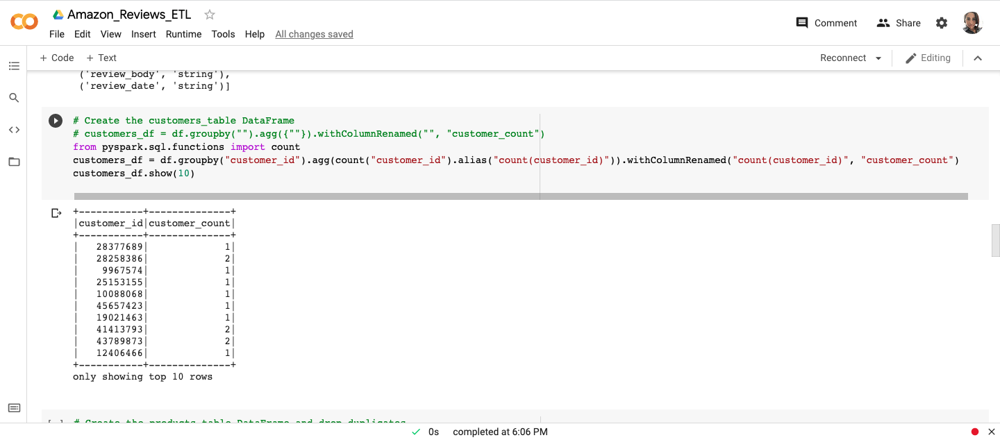
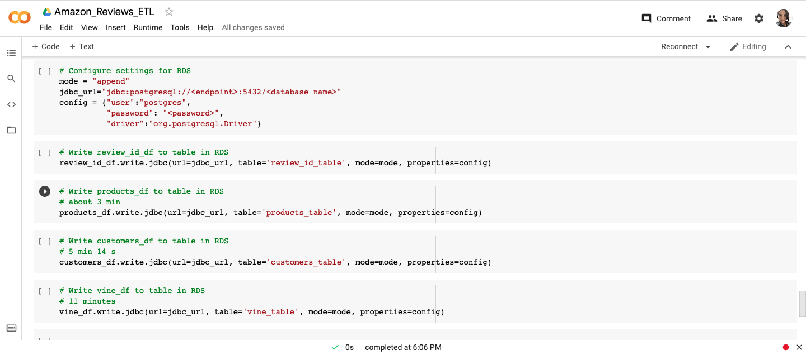
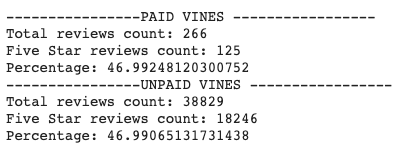
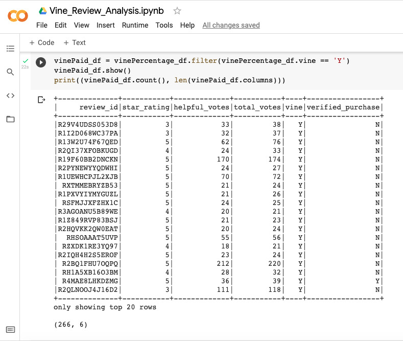
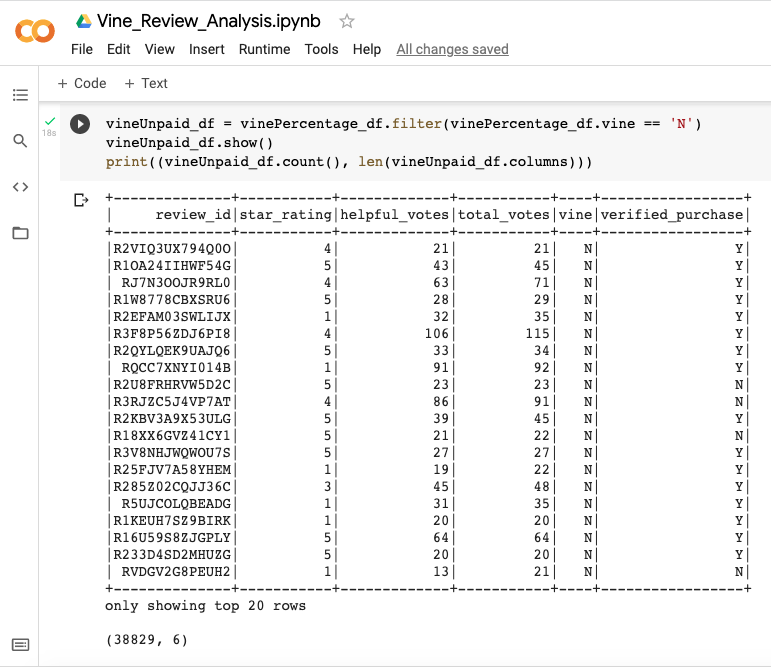

# Amazon_Vine_Analysis
ETL project

## Overview of the analysis

Sell ​​By, part of the Amazon Vine program offers its home improvement products. They wants to know what is the big picture of their products depending of the reviews on the amazon page 

The google console, pyspark, aws, rds, and Postgres technologies are used for this task. Also, we use the ETL process for the analysis of the data.
________________
### Process

# *Extrac*

#### Read the url form Amazon S3 drive and extract the data to a DataFrame

# *Transform*
#### Transform the data to a smallest DataFrames

# *Load*
#### Load the data to a RDS in Amazon Web Service

______________
## Results

### Resume table

1. How many Vine reviews and non-Vine reviews were there?
    #### Vine reviews : *266*
    #### non/Vine reviews : *38,829*

### Vine reviews

### non-Vine reviews

2. How many Vine reviews were 5 stars? How many non-Vine reviews were 5 stars?
    #### Vine reviews : *125*
    #### non/Vine reviews : *18,246*

.         

3. What percentage of Vine reviews were 5 stars? What percentage of non-Vine reviews were 5 stars?
    #### Vine reviews : *46.99%*
    #### non/Vine reviews : *46.99%*

## Summary

It's curious that the percentage of 5-star reviews is the same in vines and in non-vines. There's possible a bias and the information is not real. Because the behavior and preferences of the humans not always respond to a patron

### Additional analysis
If we filter the data with verified purchase field in true, now we can say that the reviews are from person who bought the product.
